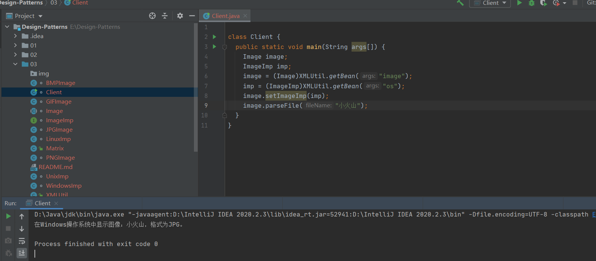

# 人工智能第三次作业
像素矩阵类：辅助类，各种格式的文件最终都被转化为像素矩阵
```
public class Matrix {
}
```
抽象图像类：抽象类
```
abstract class Image {
}
```
GIF格式图像：扩充抽象类 
```
class GIFImage extends Image {
} 
```
BMP格式图像：扩充抽象类
```
class BMPImage extends Image {
}  
```
PNG格式图像：扩充抽象类 
```
class PNGImage extends Image {
} 
```
JPG格式图像：扩充抽象类  
```
class JPGImage extends Image {
}
```
抽象操作系统实现类：实现类接口 
```
interface ImageImp {
}   
```
Linux操作系统实现类：具体实现类
```
class LinuxImp implements ImageImp {
}
```
Unix操作系统实现类：具体实现类  
```
class UnixImp implements ImageImp {
}
```
Windows操作系统实现类：具体实现类
```
class WindowsImp implements ImageImp {
}
```
## 运行结果
